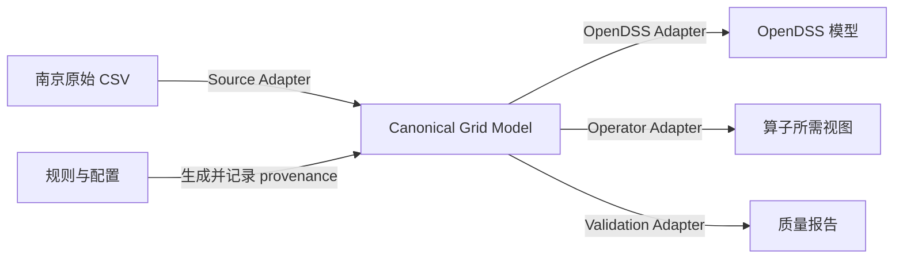
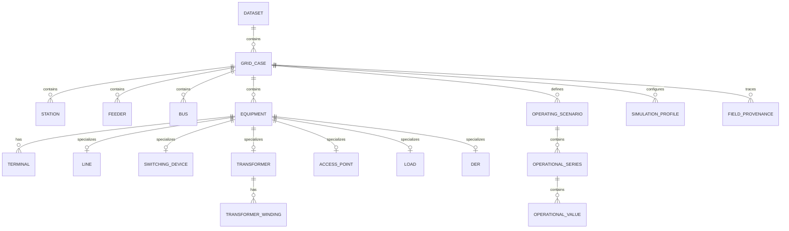

# 统一电网数据模型规范

## 1. 文档信息

| 项目 | 值 |
|---|---|
| 状态 | Draft |
| 规范版本 | `0.1.0` |
| 分析对象 | `data/raw/南京数据.zip` |
| SHA-256 | `7ae1e246e5ac8073053d280cd64e66cdc491d5303dc2c15aa74f823be202de25` |
| 需求依据 | `docs/intent.md` |

本文定义南京原始 CSV 到统一电网数据模型（Canonical Grid Model，以下简称 Canonical Model）的映射契约。它描述数据语义、约束和扩展边界，不规定存储格式、编程语言、数据库或具体算法实现。

本文中的“必须”“不得”是强约束，“应”是推荐约束，“可”表示可选能力。

## 2. 目标与非目标

### 2.1 目标

Canonical Model 必须：

1. 无损保留原始标识符、源记录和拓扑引用；
2. 统一描述站点、馈线、母线、设备、连接关系和电气参数；
3. 支持负荷、分布式能源（DER）、快照和时序运行数据；
4. 区分源数据、规则生成数据和推导数据，并记录来源；
5. 为 OpenDSS 导出和未来算法适配提供稳定、与目标格式无关的数据契约；
6. 允许“不完整但忠实”的导入结果，并独立判断其是否达到仿真或算法使用条件。

### 2.2 非目标

本文不：

- 恢复南京真实电网参数或历史运行状态；
- 为缺失字段指定虚构默认值；
- 将原始目录名、设备名称或相近数值自动认定为可靠外键；
- 假设任何具体智能电网算子的输入字段、张量形状、文件格式或采样窗口；
- 规定参数补全、拓扑修复、OpenDSS 生成或算子适配的实现代码。

## 3. 南京原始数据分析

### 3.1 数据集概况

压缩包已按全部 CSV 逐行只读检查，结论如下：

- 共 5,159 个馈线目录、61,908 个 CSV 文件；每个目录均包含 12 类 CSV。
- 所有文件均可按 UTF-8 with BOM 读取，同类文件的表头完全一致。
- 共有 5,134 条 `Feeder` 记录，25 个目录的 `Feeder` 文件只有表头。
- `Load` 和 `DER` 在所有目录中均只有表头，无数据行。
- 各类相位字段均为空；线路电气参数全部为空；站点经纬度全部为空。
- 所有 `SimConfig` 文件都包含相同的 11 个键值，不能据此认定每条馈线已经具备真实、独立的仿真配置。

| 文件 | 文件数 | 数据行数 | 当前可用信息 | 主要缺口或异常 |
|---|---:|---:|---|---|
| `01_Station.csv` | 5,159 | 59,375 | ID、类型、名称、电压等级 | 经纬度全空；跨算例存在重复资产 |
| `02_Bus.csv` | 5,159 | 68,537 | ID、名称、基准电压、所属站点、是否电源 | 相位全空；7 条站点引用为空，294 条引用无法精确解析 |
| `03_Switch.csv` | 5,159 | 272,716 | ID、常态、联络标志、部分量测 | 相位和额定电流全空；大量端点为空或失真；同一算例内有重复 ID |
| `04_Disconnector.csv` | 5,159 | 18,016 | ID、常态 | 两端引用全空 |
| `05_Feeder.csv` | 5,159 | 5,134 | ID、名称、电源母线 | 25 个目录无记录 |
| `06_EarthingSwitch.csv` | 5,159 | 225,301 | ID、状态 | 接入母线全空 |
| `07_AccessPoint.csv` | 5,159 | 34,661 | ID | 母线、相位、用户类型、合同容量全空 |
| `08_Line.csv` | 5,159 | 156,527 | ID和两个原始端点引用 | 相位、类型、型号、长度、阻抗、回路数全空 |
| `09_Transformer.csv` | 5,159 | 110,338 | ID；15,474 条有容量 | 端点、相位、电压、阻抗、接线和分接信息全空；单个目录存在 44,596 行异常高值 |
| `10_Load.csv` | 5,159 | 0 | 仅表头 | 无负荷实体或功率数据 |
| `11_DER.csv` | 5,159 | 0 | 仅表头 | 无 DER 实体或参数 |
| `12_SimConfig.csv` | 5,159 | 56,749 | 11 个通用配置键 | 值在全部目录中完全相同；母线名称为未解析占位符 |

### 3.2 不能忽略的源数据语义问题

#### 3.2.1 标识符必须作为字符串

原始 ID 最长达到 19 位。部分引用已出现科学计数法或长整数末位被舍入的迹象，例如：

- `Bus_Station_ID` 中出现 `1.13997365584593e+17`；
- 开关端点中出现与候选实体接近但不相等的长整数；
- `Bus_ID` 同时包含纯数字形式和带 `_bs` 后缀的形式。

因此所有 ID 和引用必须按原始字符串读取和保存，禁止经过二进制浮点数。科学计数法转整数或“最近 ID”只能产生修复候选，不能自动成为已确认外键。

#### 3.2.2 `FromBus` / `ToBus` 并不总是引用 Bus

在同一馈线目录内按精确字符串匹配，`Line_FromBus` 实际可指向 Bus、Switch、Station、Transformer 或 AccessPoint；`Line_ToBus` 也可指向 Switch、Transformer、Bus 或 AccessPoint。主要分布如下：

| 原始字段 | Bus | Switch | Station | Transformer | AccessPoint | 未解析/零值 |
|---|---:|---:|---:|---:|---:|---:|
| `Line_FromBus` | 89,966 | 62,504 | 3,706 | 25 | 297 | 29 |
| `Line_ToBus` | 23,339 | 107,976 | 0 | 14,285 | 7,430 | 3,497 |
| `Switch_FromBus` | 39,096 | 7,868 | 1,589 | 1 | 12 | 224,150（含 163,849 个空值） |
| `Switch_ToBus` | 804 | 2,149 | 0 | 919 | 111 | 268,733（含 209,759 个空值） |

这说明源数据更接近“设备/连接点混合图”，而不是已经规范化的母线—支路模型。Canonical Model 必须保留带类型的原始端点，不能把这些列直接声明为 `Bus` 外键。

#### 3.2.3 重复 ID 不能被静默去重

`Switch_ID` 在 607 个算例内存在重复，共多出 1,255 行。其中：

- 330 组内容完全相同，可作为候选重复记录；
- 489 组内容冲突，常见情况是同一 `Switch_ID` 对应不同 `ToBus`。

导入层必须用源文件路径和行号区分原始记录。冲突记录在规则确认前不得合并；它们应形成阻断性质量问题。

#### 3.2.4 运行量测没有时间语义

7,804 条开关记录声明 `Switch_HasMeasurement=True`，但所有 `Switch_Meas_Timestamp` 均为空。电流、P、Q 的非空数分别为 7,803、7,756、7,755，且包含负值和明显离群值。它们只能作为“时间未知的源快照值”导入，不能伪造时间戳或直接组成时间序列。

### 3.3 原始仿真配置

每个目录都包含下列相同配置：

| `Config_Key` | 原始值 | Canonical 语义 |
|---|---|---|
| `SimulationMode` | `Snapshot` | 仿真模式 |
| `Algorithm` | `Newton-Raphson` | 求解方法 |
| `BaseFrequency` | `50` | 基准频率，Hz |
| `BaseVoltage_kV` | `10.5` | 源基准电压，kV |
| `SourceBus` | `SUB_10KV` | 原始源母线引用，当前未解析 |
| `OutputVoltageBus` | `SUB_10KV` | 原始观测母线引用，当前未解析 |
| `MaxIterations` | `100` | 最大迭代次数 |
| `Tolerance` | `0.0001` | 收敛容差，原始语义待仿真适配器确认 |
| `MVAsc3` | `500` | 三相短路容量，MVA |
| `MVAsc1` | `450` | 单相短路容量，MVA |
| `UnitSystem` | `Metric` | 单位制 |

这些值可映射到仿真配置对象，但其来源状态必须保持为 `SOURCE`，不能标记为已验证参数。

## 4. Canonical Model 总体设计

### 4.1 分层和依赖方向

Canonical Model 不依赖 CSV 列名、OpenDSS 对象名或任何算子格式。Adapter 依赖 Canonical Model；Canonical Model 不反向依赖 Adapter。

### 4.2 逻辑实体关系

`TERMINAL` 的连接目标是带类型的实体引用，目标可为 `BUS`、`STATION`、`EQUIPMENT` 或未解析引用。这样既能忠实承接南京混合图，也允许后续 Adapter 在质量规则满足后构造母线—支路视图。

## 5. 通用类型和约束

### 5.1 基础类型

| 类型 | 定义 |
|---|---|
| `Identifier` | 非空 Unicode 字符串；禁止浮点转换；大小写和前导/后缀字符有意义 |
| `CanonicalId` | Canonical 内部稳定 ID；至少在 `case_id + entity_type` 范围内唯一 |
| `SourceId` | 源字段原文，去除 CSV 结构性引号后不得改写 |
| `Decimal` | 十进制定点数；精度由字段约束决定 |
| `Boolean` | `true` / `false`；源值大小写仅在映射时归一化 |
| `PhaseSet` | 有序集合，如 `A`、`B`、`C`、`N` 的组合；未知必须为 `null`，不得默认 `ABC` |
| `Timestamp` | ISO 8601 时间戳，必须携带时区或引用明确的 `timezone` |
| `EntityRef` | `{entity_type, entity_id}`；未解析时同时保留 `raw_ref` 和解析状态 |
| `Quantity` | 十进制值加显式单位；同一字段不得混用单位 |

### 5.2 标识和作用域

- `case_id` 表示一次可独立处理的馈线算例。它必须由源目录记录稳定派生，并保留 `source_case_key`。
- `Feeder_ID` 只作为馈线业务标识；由于 25 个目录无 Feeder 记录，不能作为唯一的 case 建立依据。
- 原始实体 ID 跨馈线会重复。正常记录的实体逻辑键必须包含 `case_id`、实体类型和 `source_id`。
- 同一算例、同一实体类型内发生源 ID 冲突时，不得覆盖。冲突记录先以 `source_record_ref` 作为消歧成分生成不同 Canonical ID，并将 `identity_status` 标记为冲突；治理确认后才可合并。
- Adapter 可生成目标系统名称，但不得回写或替换 Canonical ID。

### 5.3 空值和状态

- 空字符串映射为 `null`，同时由 provenance 保留源字段为空这一事实。
- 数值 `0` 不等同于空值；引用字段中的字符串 `"0"` 必须标记为无效引用候选，而不是 null。
- 未知、不可用、不适用、未解析必须使用不同的状态字段表达，不得都编码为魔法值。
- Import Complete、Topology Resolved、Simulation Ready 是三个独立状态。导入成功不代表可仿真。

### 5.4 枚举归一化

| 语义 | Canonical 值 | 已观察源值 |
|---|---|---|
| 开关状态 | `OPEN`、`CLOSED`、`UNKNOWN` | `Open`、`Closed` |
| 布尔值 | `true`、`false` | `TRUE/FALSE`、`True/False` |
| 来源类型 | `SOURCE`、`RULE_GENERATED`、`DERIVED`、`MANUAL` | 由转换过程赋值 |
| 引用解析状态 | `MISSING`、`EXACT`、`NORMALIZED_CANDIDATE`、`AMBIGUOUS`、`UNRESOLVED`、`CONFIRMED_REPAIR` | 由引用解析过程赋值 |
| 数据质量 | `VALID`、`SUSPECT`、`INVALID`、`TIME_UNKNOWN` | 由校验过程赋值 |

未知枚举值必须保留原文并映射为 `UNKNOWN`，不得丢弃记录。

## 6. 核心数据模型

下表中的“必需性”含义：`R` 为导入后必需，`N` 为允许空值，`S` 为进入仿真导出前必需，`C` 为条件必需。

### 6.1 Dataset 与 GridCase

#### Dataset

| 字段 | 类型 | 必需性 | 说明 |
|---|---|---:|---|
| `dataset_id` | `CanonicalId` | R | 一次源数据批次 |
| `name` | string | R | 数据集名称 |
| `source_uri` | string | R | 源文件位置或受控引用 |
| `source_checksum` | string | R | 源文件校验值 |
| `canonical_spec_version` | string | R | 本规范版本 |
| `imported_at` | `Timestamp` | R | 导入时间 |

#### GridCase

| 字段 | 类型 | 必需性 | 说明 |
|---|---|---:|---|
| `case_id` | `CanonicalId` | R | 馈线算例内部 ID |
| `dataset_id` | `CanonicalId` | R | 所属数据集 |
| `source_case_key` | string | R | 压缩包内目录路径，精确保留 |
| `feeder_id` | `CanonicalId` | N | 已解析的馈线实体 |
| `timezone` | string | C | 时序数据存在时必需；南京数据默认候选为 `Asia/Shanghai`，须由配置确认 |
| `import_status` | enum | R | 导入状态 |
| `topology_status` | enum | R | 拓扑解析状态 |
| `simulation_readiness` | enum | R | 仿真就绪状态及原因摘要 |

### 6.2 Station、Feeder 与 Bus

#### Station

| 字段 | 类型 | 必需性 | 单位/说明 |
|---|---|---:|---|
| `station_id` | `CanonicalId` | R | 算例内唯一 |
| `case_id` | `CanonicalId` | R | 所属算例 |
| `source_id` | `SourceId` | R | 原始 Station ID |
| `station_type` | string/enum | R | 原始类型可归一化但必须保留原文 |
| `name` | string | R | 站点名称 |
| `nominal_voltage_kv` | `Decimal` | N | kV；与 Bus 基准电压含义分开 |
| `longitude` | `Decimal` | N | 坐标系确认后方可使用 |
| `latitude` | `Decimal` | N | 坐标系确认后方可使用 |
| `coordinate_crs` | string | C | 坐标非空时必需 |

#### Feeder

| 字段 | 类型 | 必需性 | 说明 |
|---|---|---:|---|
| `feeder_id` | `CanonicalId` | R | 算例内唯一 |
| `case_id` | `CanonicalId` | R | 所属算例 |
| `source_id` | `SourceId` | R | 原始 Feeder ID |
| `name` | string | R | 馈线名称 |
| `source_bus_ref` | `EntityRef` | R/S | 必须解析为本算例 Bus 后方可仿真 |

#### Bus

| 字段 | 类型 | 必需性 | 单位/说明 |
|---|---|---:|---|
| `bus_id` | `CanonicalId` | R | 算例内唯一 |
| `case_id` | `CanonicalId` | R | 所属算例 |
| `source_id` | `SourceId` | R | 允许 `_bs` 等非数字形式 |
| `name` | string | R | 母线名称 |
| `base_voltage_kv` | `Decimal` | R/S | kV |
| `phases` | `PhaseSet` | N/S | 原始为空，不得默认三相 |
| `station_ref` | `EntityRef` | N | 指向 Station；保留解析状态 |
| `is_source` | `Boolean` | R | 是否源母线 |

### 6.3 Equipment 与 Terminal

#### Equipment

所有导电设备共享下列字段，具体电气参数位于对应子类型。

| 字段 | 类型 | 必需性 | 说明 |
|---|---|---:|---|
| `equipment_id` | `CanonicalId` | R | 算例内所有 Equipment 中唯一；可编码源类型以避免跨类型碰撞 |
| `case_id` | `CanonicalId` | R | 所属算例 |
| `source_id` | `SourceId` | R | 原始设备 ID |
| `equipment_type` | enum | R | `LINE`、`SWITCH`、`DISCONNECTOR`、`EARTHING_SWITCH`、`TRANSFORMER`、`ACCESS_POINT`、`LOAD`、`DER` |
| `name` | string | N | 原始数据未提供时保持 null |
| `phases` | `PhaseSet` | N/S | 对需要仿真的设备，导出前必须确定 |
| `in_service` | `Boolean` | N | 不得由 `normal_state` 自动推断 |
| `identity_status` | enum | R | `UNIQUE`、`DUPLICATE_IDENTICAL` 或 `DUPLICATE_CONFLICT` |

#### Terminal

| 字段 | 类型 | 必需性 | 说明 |
|---|---|---:|---|
| `terminal_id` | `CanonicalId` | R | 终端内部 ID |
| `case_id` | `CanonicalId` | R | 所属算例 |
| `equipment_id` | `CanonicalId` | R | 所属设备 |
| `terminal_no` | integer | R | 从 1 开始，在设备内唯一 |
| `raw_connected_ref` | `SourceId` | N | 原始端点字段，不得改写 |
| `connected_entity_ref` | `EntityRef` | N | 可指向 Bus、Station 或 Equipment |
| `resolution_status` | enum | R | 端点解析状态 |
| `phases` | `PhaseSet` | N | 若比设备相位更具体则填写 |

线路、普通开关和隔离开关应有两个 Terminal；接地开关、接入点、负荷和 DER 通常为单 Terminal；变压器 Terminal 数量与绕组数一致。原始端点为空时仍可创建 Terminal，但状态必须为 `MISSING`。

### 6.4 设备电气参数

#### Line

| 字段 | 类型 | 必需性 | 单位/说明 |
|---|---|---:|---|
| `equipment_id` | `CanonicalId` | R | 对应 Equipment |
| `line_type` | string/enum | N | 架空、电缆等；未知不得推断 |
| `model` | string | N | 型号或模型名 |
| `length_km` | `Decimal` | N/S | km，必须大于 0 |
| `r1_ohm_per_km` | `Decimal` | N/C | 正序电阻，Ω/km |
| `x1_ohm_per_km` | `Decimal` | N/C | 正序电抗，Ω/km |
| `r0_ohm_per_km` | `Decimal` | N/C | 零序电阻，Ω/km |
| `x0_ohm_per_km` | `Decimal` | N/C | 零序电抗，Ω/km |
| `c1_nf_per_km` | `Decimal` | N | 正序电容，nF/km |
| `c0_nf_per_km` | `Decimal` | N | 零序电容，nF/km |
| `rated_current_a` | `Decimal` | N | A |
| `number_of_circuits` | integer | N/S | 正整数 |
| `parameter_set_ref` | `CanonicalId` | N/C | 可引用经确认的 LineCode/典型参数集 |

仿真导出时，线路必须具备长度，并满足“显式阻抗参数”或“可解析参数集”之一。具体 OpenDSS 字段选择属于 Adapter，不进入 Canonical 核心。

#### SwitchingDevice

| 字段 | 类型 | 必需性 | 单位/说明 |
|---|---|---:|---|
| `equipment_id` | `CanonicalId` | R | 对应 Equipment |
| `switch_kind` | enum | R | `SWITCH`、`DISCONNECTOR`、`EARTHING_SWITCH` |
| `normal_state` | enum | N | 规划常态，`OPEN/CLOSED/UNKNOWN` |
| `observed_state` | enum | N | 无明确“常态”语义时使用 |
| `is_tie` | `Boolean` | N | 是否联络设备 |
| `rated_current_a` | `Decimal` | N | A |
| `measurement_capable` | `Boolean` | N | 是否声明具备量测 |

`normal_state`、`observed_state` 和 `in_service` 是不同概念，不得互相隐式赋值。

#### Transformer 与 TransformerWinding

| Transformer 字段 | 类型 | 必需性 | 单位/说明 |
|---|---|---:|---|
| `equipment_id` | `CanonicalId` | R | 对应 Equipment |
| `rated_capacity_kva` | `Decimal` | N/S | kVA，必须大于 0；源值 0 应标记异常 |
| `r_pct` | `Decimal` | N/S | 百分数 |
| `x_pct` | `Decimal` | N/S | 百分数 |
| `number_of_taps` | integer | N | 分接数量 |
| `tap_min_pu` | `Decimal` | N | 最小分接标幺值 |
| `tap_max_pu` | `Decimal` | N | 最大分接标幺值 |
| `tap_range_raw` | string | N | 原始格式无法确认时保存原文 |

| TransformerWinding 字段 | 类型 | 必需性 | 单位/说明 |
|---|---|---:|---|
| `winding_id` | `CanonicalId` | R | 绕组 ID |
| `equipment_id` | `CanonicalId` | R | 所属变压器 |
| `winding_no` | integer | R | 从 1 开始 |
| `terminal_id` | `CanonicalId` | R | 对应 Terminal |
| `rated_voltage_kv` | `Decimal` | N/S | kV |
| `connection` | enum/string | N/S | 如星形、三角形；未知值保留原文 |
| `rated_capacity_kva` | `Decimal` | N | 绕组额定容量，可继承设备容量但须记录推导来源 |

采用绕组子表而不是固定高、低压字段，使模型可以扩展到三绕组变压器；南京当前字段映射为 1、2 号绕组。

#### AccessPoint

| 字段 | 类型 | 必需性 | 单位/说明 |
|---|---|---:|---|
| `equipment_id` | `CanonicalId` | R | 对应 Equipment |
| `user_type` | string/enum | N | 用户类型 |
| `contract_capacity_kva` | `Decimal` | N | kVA，非负 |

AccessPoint 表示潜在负荷/DER 接入位置，不自动等同于 Load 或 DER。

### 6.5 Load 与 DER

#### Load

| 字段 | 类型 | 必需性 | 单位/说明 |
|---|---|---:|---|
| `equipment_id` | `CanonicalId` | R | 对应 Equipment |
| `active_power_kw` | `Decimal` | N/C | 静态/额定有功，kW |
| `reactive_power_kvar` | `Decimal` | N/C | 静态/额定无功，kvar |
| `power_factor` | `Decimal` | N/C | 绝对值不大于 1；超前/滞后语义需单独表达 |
| `power_factor_mode` | enum | N | `LEADING`、`LAGGING`、`UNKNOWN` |
| `connection` | string/enum | N/S | 接线方式 |
| `load_model` | string/enum | N | 恒功率/恒阻抗等；不得默认 |
| `nominal_voltage_kv` | `Decimal` | N/C | kV |

P、Q、PF 同时存在时必须通过约束校验；不一致时保留源值并报告，不得静默重算覆盖。

#### DER

| 字段 | 类型 | 必需性 | 单位/说明 |
|---|---|---:|---|
| `equipment_id` | `CanonicalId` | R | 对应 Equipment |
| `der_type` | string/enum | R | 如 PV、储能等；允许扩展 |
| `rated_capacity_kva` | `Decimal` | N/C | kVA |
| `rated_power_kw` | `Decimal` | N/C | kW |
| `power_factor` | `Decimal` | N | 绝对值不大于 1 |
| `connection` | string/enum | N/S | 接线方式 |
| `control_mode` | string/enum | N | 控制模式；核心模型不使用 OpenDSS 专属枚举 |
| `nominal_voltage_kv` | `Decimal` | N/C | kV |

### 6.6 时序运行数据

#### OperatingScenario

| 字段 | 类型 | 必需性 | 说明 |
|---|---|---:|---|
| `scenario_id` | `CanonicalId` | R | 场景 ID |
| `case_id` | `CanonicalId` | R | 所属算例 |
| `name` | string | R | 场景名称 |
| `start_time` | `Timestamp` | C | 时序场景必需 |
| `end_time` | `Timestamp` | C | 时序场景必需 |
| `resolution_seconds` | integer | C | 固定间隔场景必需，正整数 |
| `timezone` | string | C | 时序场景必需 |
| `generation_config_ref` | string | N | 生成配置版本/校验值 |
| `random_seed` | integer/string | C | 包含随机过程时必需 |

#### OperationalSeries

| 字段 | 类型 | 必需性 | 说明 |
|---|---|---:|---|
| `series_id` | `CanonicalId` | R | 序列 ID |
| `scenario_id` | `CanonicalId` | N | 源快照可为空；生成时序必须指定 |
| `target_ref` | `EntityRef` | R | 可指向 Bus、Equipment、Feeder 等 |
| `metric` | string/registry key | R | 如 `active_power`、`reactive_power`、`current`、`voltage`、`switch_state` |
| `unit` | string | C | 数值型物理量必需 |
| `phase` | string | N | 分相序列时填写 |
| `series_kind` | enum | R | `SNAPSHOT` 或 `TIME_SERIES` |
| `value_type` | enum | R | `DECIMAL`、`BOOLEAN`、`CATEGORY` |
| `quality` | enum | R | 序列整体质量状态 |

#### OperationalValue

| 字段 | 类型 | 必需性 | 说明 |
|---|---|---:|---|
| `series_id` | `CanonicalId` | R | 所属序列 |
| `timestamp` | `Timestamp` | C | `TIME_SERIES` 必需；时间未知的源快照允许为空 |
| `sequence_no` | integer | C | 无时间戳快照或需要保持源顺序时使用 |
| `decimal_value` | `Decimal` | C | 与其他 value 字段三选一 |
| `boolean_value` | `Boolean` | C | 与其他 value 字段三选一 |
| `category_value` | string | C | 与其他 value 字段三选一 |
| `quality` | enum | R | 点级质量，例如 `TIME_UNKNOWN`、`SUSPECT` |

约束：

- `TIME_SERIES` 的时间戳必须非空、同一序列内唯一且严格递增；
- 固定间隔序列必须覆盖声明窗口，不得用重复末值掩盖缺口；
- 负荷和 DER 的静态额定值位于实体表，运行曲线位于 OperationalSeries；
- 开关状态、P/Q、电流、电压均使用相同的通用序列机制，不为某个算子创建专属核心字段。

### 6.7 SimulationProfile

| 字段 | 类型 | 必需性 | 单位/说明 |
|---|---|---:|---|
| `simulation_profile_id` | `CanonicalId` | R | 配置 ID |
| `case_id` | `CanonicalId` | R | 所属算例 |
| `scenario_id` | `CanonicalId` | N | QSTS 等场景引用 |
| `mode` | string/enum | R | Snapshot、QSTS 等中立语义 |
| `solver` | string/enum | N | 求解器/方法 |
| `frequency_hz` | `Decimal` | N/S | Hz |
| `source_voltage_kv` | `Decimal` | N/S | kV |
| `source_bus_ref` | `EntityRef` | N/S | 必须解析为 Canonical Bus 后方可导出 |
| `output_voltage_bus_ref` | `EntityRef` | N | 观测母线 |
| `max_iterations` | integer | N | 正整数 |
| `tolerance` | `Decimal` | N | 需由目标仿真 Adapter 解释 |
| `mva_sc3` | `Decimal` | N | 三相短路容量，MVA |
| `mva_sc1` | `Decimal` | N | 单相短路容量，MVA |
| `unit_system` | string/enum | N | 单位制 |
| `extensions` | namespaced map | N | 保存未识别配置键；核心使用方不得依赖源专属键 |

### 6.8 FieldProvenance

每个生成或推导字段必须具备字段级来源；直接映射字段也应保留来源。

| 字段 | 类型 | 必需性 | 说明 |
|---|---|---:|---|
| `provenance_id` | `CanonicalId` | R | 来源记录 ID |
| `case_id` | `CanonicalId` | R | 所属算例 |
| `target_ref` | `EntityRef` | R | 目标实体 |
| `field_path` | string | R | 目标字段路径 |
| `origin` | enum | R | `SOURCE`、`RULE_GENERATED`、`DERIVED`、`MANUAL` |
| `source_record_ref` | string | C | 源文件路径加 1-based 数据行号 |
| `source_field` | string | C | 原始列名 |
| `rule_id` | string | C | 生成/推导时必需 |
| `rule_version` | string | C | 生成/推导时必需 |
| `config_ref` | string | C | 生成配置版本或校验值 |
| `random_seed` | integer/string | C | 使用随机过程时必需 |
| `assumption` | string | N | 可读的假设说明 |

## 7. 南京 CSV 到 Canonical Model 的字段映射

### 7.1 通用转换规则

1. 每条源记录先建立 `source_record_ref = 压缩包内相对路径 + 数据行号`。
2. 所有 `*_ID` 和引用列按字符串读取；不得先转为整数或浮点数。
3. 空字符串映射为 null，不生成默认值。
4. 单位已包含在列名中的数值按对应 Canonical 单位解析为 Decimal。
5. 每个设备 ID 同时映射到 `equipment.source_id` 和设备子类型的 `equipment_id`。
6. `FromBus`、`ToBus`、`*_Bus` 先映射到 Terminal 的 `raw_connected_ref`，只有通过引用解析规则后才填写 `connected_entity_ref`。
7. 直接映射值的 provenance 为 `SOURCE`；任何清洗、确认修复、推导或补全必须使用不同 origin 和规则记录。

### 7.2 `01_Station.csv`

| 原始字段 | Canonical 字段 | 转换/约束 |
|---|---|---|
| `Station_ID` | `station.source_id`；派生 `station.station_id` | 原文字符串；逻辑键包含 case 和实体类型 |
| `Station_Type` | `station.station_type` | 保留原文；可另做受控枚举映射 |
| `Station_Name` | `station.name` | 原文字符串 |
| `Station_Voltage_Level` | `station.nominal_voltage_kv` | Decimal，kV |
| `Station_Lon` | `station.longitude` | Decimal；当前全空；CRS 未确认不得使用 |
| `Station_Lat` | `station.latitude` | Decimal；当前全空；CRS 未确认不得使用 |

### 7.3 `02_Bus.csv`

| 原始字段 | Canonical 字段 | 转换/约束 |
|---|---|---|
| `Bus_ID` | `bus.source_id`；派生 `bus.bus_id` | 字符串，允许 `_bs` 后缀 |
| `Bus_Name` | `bus.name` | 原文字符串 |
| `Bus_BaseKV` | `bus.base_voltage_kv` | Decimal，kV |
| `Bus_Phase` | `bus.phases` | 解析为 PhaseSet；当前全空，保持 null |
| `Bus_Station_ID` | `bus.station_ref.raw_ref` 及解析结果 | 仅精确匹配可直接设为 `EXACT`；科学计数法值作为候选修复 |
| `Bus_IsSource` | `bus.is_source` | `TRUE/FALSE` 不区分大小写映射为 Boolean |

### 7.4 `03_Switch.csv`

| 原始字段 | Canonical 字段 | 转换/约束 |
|---|---|---|
| `Switch_ID` | `equipment.source_id`；派生 `equipment.equipment_id` | 类型为 `SWITCH`；重复/冲突不得覆盖 |
| `Switch_FromBus` | `terminal[1].raw_connected_ref` 及解析结果 | 不预设目标为 Bus |
| `Switch_ToBus` | `terminal[2].raw_connected_ref` 及解析结果 | 不预设目标为 Bus |
| `Switch_Phase` | `equipment.phases` | PhaseSet；当前全空 |
| `Switch_NormalState` | `switching_device.normal_state` | `Open/Closed` 映射到 Canonical 枚举 |
| `Switch_IsTie` | `switching_device.is_tie` | Boolean |
| `Switch_RatedCurrent_A` | `switching_device.rated_current_a` | Decimal，A；当前全空 |
| `Switch_HasMeasurement` | `switching_device.measurement_capable` | Boolean |
| `Switch_Meas_I_A` | `operational_series(metric=current, unit=A)` 的快照值 | 时间为空时 quality=`TIME_UNKNOWN` |
| `Switch_Meas_P_kW` | `operational_series(metric=active_power, unit=kW)` 的快照值 | 允许保留负值，另做方向/异常校验 |
| `Switch_Meas_Q_kVAR` | `operational_series(metric=reactive_power, unit=kvar)` 的快照值 | 允许保留负值，另做方向/异常校验 |
| `Switch_Meas_Timestamp` | 上述快照值的 `timestamp` | 当前全空；不得伪造时间 |

### 7.5 `04_Disconnector.csv`

| 原始字段 | Canonical 字段 | 转换/约束 |
|---|---|---|
| `Disconnector_ID` | `equipment.source_id`；派生 `equipment.equipment_id` | 类型为 `DISCONNECTOR` |
| `Disconnector_FromBus` | `terminal[1].raw_connected_ref` 及解析结果 | 当前全空，状态为 `MISSING` |
| `Disconnector_ToBus` | `terminal[2].raw_connected_ref` 及解析结果 | 当前全空，状态为 `MISSING` |
| `Disconnector_NormalState` | `switching_device.normal_state` | `Open/Closed` 枚举；当前均为 Closed |

### 7.6 `05_Feeder.csv`

| 原始字段 | Canonical 字段 | 转换/约束 |
|---|---|---|
| `Feeder_ID` | `feeder.source_id`；派生 `feeder.feeder_id` | 字符串；一个有效目录期望一条记录 |
| `Feeder_Name` | `feeder.name` | 原文字符串；名称不作为主键 |
| `Feeder_SourceBus` | `feeder.source_bus_ref` | 精确匹配本 case Bus；当前 5,134 条均可精确匹配 |

### 7.7 `06_EarthingSwitch.csv`

| 原始字段 | Canonical 字段 | 转换/约束 |
|---|---|---|
| `EarthingSwitch_ID` | `equipment.source_id`；派生 `equipment.equipment_id` | 类型为 `EARTHING_SWITCH` |
| `EarthingSwitch_Bus` | `terminal[1].raw_connected_ref` 及解析结果 | 当前全空，状态为 `MISSING` |
| `EarthingSwitch_State` | `switching_device.observed_state` | 原字段未说明是否常态，不能映射为 normal_state |

### 7.8 `07_AccessPoint.csv`

| 原始字段 | Canonical 字段 | 转换/约束 |
|---|---|---|
| `AccessPoint_ID` | `equipment.source_id`；派生 `equipment.equipment_id` | 类型为 `ACCESS_POINT` |
| `AccessPoint_Bus` | `terminal[1].raw_connected_ref` 及解析结果 | 当前全空 |
| `AccessPoint_Phase` | `equipment.phases` | PhaseSet；当前全空 |
| `AccessPoint_UserType` | `access_point.user_type` | 当前全空 |
| `AccessPoint_ContractCapacity_kVA` | `access_point.contract_capacity_kva` | Decimal，kVA；当前全空 |

### 7.9 `08_Line.csv`

| 原始字段 | Canonical 字段 | 转换/约束 |
|---|---|---|
| `Line_ID` | `equipment.source_id`；派生 `equipment.equipment_id` | 类型为 `LINE`；原文字符串 |
| `Line_FromBus` | `terminal[1].raw_connected_ref` 及解析结果 | 目标可能为多种实体类型 |
| `Line_ToBus` | `terminal[2].raw_connected_ref` 及解析结果 | 目标可能为多种实体类型 |
| `Line_Phase` | `equipment.phases` | PhaseSet；当前全空 |
| `Line_Type` | `line.line_type` | 当前全空 |
| `Line_Model` | `line.model` | 当前全空 |
| `Line_Length_km` | `line.length_km` | Decimal，km；当前全空 |
| `Line_R1_ohm_per_km` | `line.r1_ohm_per_km` | Decimal，Ω/km；当前全空 |
| `Line_X1_ohm_per_km` | `line.x1_ohm_per_km` | Decimal，Ω/km；当前全空 |
| `Line_NumCircuits` | `line.number_of_circuits` | 正整数；当前全空 |

### 7.10 `09_Transformer.csv`

| 原始字段 | Canonical 字段 | 转换/约束 |
|---|---|---|
| `Transformer_ID` | `equipment.source_id`；派生 `equipment.equipment_id` | 类型为 `TRANSFORMER` |
| `Transformer_FromBus` | `terminal[1].raw_connected_ref` 及解析结果 | 当前全空 |
| `Transformer_ToBus` | `terminal[2].raw_connected_ref` 及解析结果 | 当前全空 |
| `Transformer_Phase` | `equipment.phases` | PhaseSet；当前全空 |
| `Transformer_RatedCapacity_kVA` | `transformer.rated_capacity_kva` | Decimal，kVA；非空率约 14.0% |
| `Transformer_HighVoltage_kV` | `transformer_winding[1].rated_voltage_kv` | Decimal，kV；当前全空 |
| `Transformer_LowVoltage_kV` | `transformer_winding[2].rated_voltage_kv` | Decimal，kV；当前全空 |
| `Transformer_R_pct` | `transformer.r_pct` | Decimal，%；当前全空 |
| `Transformer_X_pct` | `transformer.x_pct` | Decimal，%；当前全空 |
| `Transformer_ConnHV` | `transformer_winding[1].connection` | 当前全空 |
| `Transformer_ConnLV` | `transformer_winding[2].connection` | 当前全空 |
| `Transformer_NumTaps` | `transformer.number_of_taps` | 整数；当前全空 |
| `Transformer_TapRange` | `transformer.tap_range_raw`，确认格式后解析到 min/max | 当前全空；不得预设编码格式 |

### 7.11 `10_Load.csv`

| 原始字段 | Canonical 字段 | 转换/约束 |
|---|---|---|
| `Load_ID` | `equipment.source_id`；派生 `equipment.equipment_id` | 类型为 `LOAD`；当前无数据行 |
| `Load_Bus` | `terminal[1].raw_connected_ref` 及解析结果 | 不预设能够解析 |
| `Load_Phase` | `equipment.phases` | PhaseSet |
| `Load_P_kW` | `load.active_power_kw` | Decimal，kW |
| `Load_Q_kVAR` | `load.reactive_power_kvar` | Decimal，kvar |
| `Load_PF` | `load.power_factor` | Decimal；方向语义需额外字段或规则 |

### 7.12 `11_DER.csv`

| 原始字段 | Canonical 字段 | 转换/约束 |
|---|---|---|
| `DER_ID` | `equipment.source_id`；派生 `equipment.equipment_id` | 类型为 `DER`；当前无数据行 |
| `DER_Bus` | `terminal[1].raw_connected_ref` 及解析结果 | 不预设能够解析 |
| `DER_Phase` | `equipment.phases` | PhaseSet |
| `DER_Type` | `der.der_type` | 开放枚举，保留未知原文 |
| `DER_RatedCapacity_kVA` | `der.rated_capacity_kva` | Decimal，kVA |
| `DER_RatedPower_kW` | `der.rated_power_kw` | Decimal，kW |
| `DER_PF` | `der.power_factor` | Decimal，绝对值不大于 1 |
| `DER_ConnType` | `der.connection` | 中立枚举/字符串 |
| `DER_ControlMode` | `der.control_mode` | 中立枚举/字符串，不直接绑定 OpenDSS |

### 7.13 `12_SimConfig.csv`

原始键值表在 Canonical 中转为一条 `SimulationProfile`。未知新增键进入带命名空间的 `extensions`，并产生提示，不得丢弃。

| 原始字段 | Canonical 字段 | 转换/约束 |
|---|---|---|
| `Config_Key` | 目标字段选择器 | 按下表选择已知字段；未知键映射到 namespaced extension |
| `Config_Value` | 所选 `simulation_profile` 字段的值 | 根据目标字段解析类型，同时保留原始字符串和 provenance |

| `Config_Key` | Canonical 字段 | 转换/约束 |
|---|---|---|
| `SimulationMode` | `simulation_profile.mode` | 原文加受控映射 |
| `Algorithm` | `simulation_profile.solver` | 原文加受控映射 |
| `BaseFrequency` | `simulation_profile.frequency_hz` | Decimal，Hz |
| `BaseVoltage_kV` | `simulation_profile.source_voltage_kv` | Decimal，kV |
| `SourceBus` | `simulation_profile.source_bus_ref.raw_ref` 及解析结果 | `SUB_10KV` 当前不能匹配源 Bus，标为 `UNRESOLVED` |
| `OutputVoltageBus` | `simulation_profile.output_voltage_bus_ref.raw_ref` 及解析结果 | `SUB_10KV` 当前不能匹配源 Bus，标为 `UNRESOLVED` |
| `MaxIterations` | `simulation_profile.max_iterations` | 正整数 |
| `Tolerance` | `simulation_profile.tolerance` | Decimal；具体收敛语义由 Adapter 校验 |
| `MVAsc3` | `simulation_profile.mva_sc3` | Decimal，MVA |
| `MVAsc1` | `simulation_profile.mva_sc1` | Decimal，MVA |
| `UnitSystem` | `simulation_profile.unit_system` | 原文加受控映射 |
| 其他键 | `simulation_profile.extensions["nanjing.<key>"]` | 原值及 provenance 完整保留 |

## 8. 引用解析与拓扑保持规则

### 8.1 解析顺序

对每个 `raw_connected_ref`，按以下阶段处理：

1. **MISSING**：空字符串，不尝试补全；
2. **EXACT**：在同一 `case_id` 内，对所有允许的实体类型做原始字符串精确匹配；
3. **AMBIGUOUS**：精确命中多个实体，或重复 ID 对应冲突记录；
4. **NORMALIZED_CANDIDATE**：仅产生候选，例如科学计数法十进制展开或已知精度损失分析；
5. **CONFIRMED_REPAIR**：只有显式、版本化规则通过且唯一命中时才可确认，并记录 provenance；
6. **UNRESOLVED**：没有可确认目标。

禁止使用名称模糊匹配、最近数值 ID、目录名猜测或无记录的拓扑重连作为自动确认依据。

### 8.2 拓扑不可变的含义

- Source Adapter 必须保留每一条源关系及其方向、文件和行号。
- 解析状态变化不改变 `raw_connected_ref`。
- 为仿真构造的母线合并、设备折叠或虚拟节点属于 Adapter 派生视图，必须有独立映射清单，不能写回原始拓扑。
- 删除重复记录、修复冲突、连接空端点均属于显式数据治理动作，而不是普通格式转换。

## 9. 校验规则与就绪等级

### 9.1 Import Complete

满足以下条件即可认为导入完成：

- 12 类文件均被识别，字段与已知 schema 相符；
- 每条源记录都有 `source_record_ref`；
- 所有 ID、原始引用和非空值均被无损保存；
- 类型转换失败和未知枚举均已形成质量事件。

Import Complete 允许 Canonical 字段为空、引用未解析或存在冲突。

### 9.2 Topology Resolved

至少要求：

- 馈线源母线精确且唯一；
- 参与目标拓扑的所有设备 Terminal 已连接或被显式排除；
- 引用不存在歧义和未确认修复；
- 不存在同类实体主键冲突；
- 根据开关常态计算的拓扑满足目标任务所需的连通性要求。

### 9.3 Simulation Ready

在 Topology Resolved 基础上，至少要求：

- Bus 和设备相位已确定；
- 线路具备长度及完整可用的阻抗参数或参数集；
- 变压器具备容量、绕组电压、接线和阻抗；
- Load/DER 有明确接入点和静态值或对应场景曲线；
- 源母线和仿真配置引用可解析；
- QSTS 场景的时区、时间范围、分辨率和数据连续性通过校验；
- 所有生成字段拥有规则版本、配置引用和必要的随机种子。

南京原始数据按当前状态不满足 Simulation Ready；这是一项数据事实，不是导入失败。

### 9.4 最低质量检查

| 类别 | 检查 |
|---|---|
| 标识 | 非空、字符串读取、作用域内唯一、重复冲突可追踪 |
| 引用 | 同 case、目标类型明确、解析状态完整、无静默修复 |
| 拓扑 | Terminal 数量合理、源母线存在、孤岛/环/开断状态按场景报告 |
| 电压 | 数值为正；Station nominal 与 Bus base 差异只报告，不自动统一 |
| 线路 | 长度为正；R/X 参数非负并有明确单位；回路数为正整数 |
| 变压器 | 容量和绕组电压为正；阻抗和分接范围合理；绕组与 Terminal 对应 |
| 负荷/DER | P、Q、PF 一致性；额定值与运行值分离；符号约定明确 |
| 时序 | 时区明确、时间唯一递增、步长一致、缺口显式、场景边界完整 |
| 量测 | 时间未知与离群值不被伪装为有效时序点 |
| 来源 | 生成/推导字段均可追溯到规则、配置、版本和随机种子 |

## 10. Adapter 扩展机制

### 10.1 Adapter 通用契约

每个 Adapter 必须声明元数据，而不是让 Canonical Model 猜测消费者需求：

| 声明项 | 说明 |
|---|---|
| `adapter_id` / `adapter_version` | Adapter 身份与版本 |
| `canonical_spec_versions` | 支持的 Canonical 规范版本范围 |
| `required_capabilities` | 如 topology、line parameters、load time series、power-flow result |
| `required_fields` | 以 Canonical 字段路径声明，不使用源 CSV 列名 |
| `accepted_quality` | 是否允许 null、suspect、derived 或 unresolved 数据 |
| `scenario_requirements` | 是否需要场景、时间窗口、粒度和时区 |
| `output_contract` | Adapter 自己的输出 schema/版本；不进入 Canonical 核心 |
| `mapping_manifest` | 输出对象与 Canonical ID 的双向映射 |

Adapter 在执行前必须进行能力和质量检查。缺少条件时返回结构化的 unmet requirements，不得在 Adapter 内静默补值。

### 10.2 OpenDSS Adapter

OpenDSS Adapter 是 Canonical Model 的消费者，负责：

- 将已解析的混合设备图投影为 OpenDSS 所需的母线—元件结构；
- 对对象名进行目标格式安全化，同时输出 Canonical ID 映射清单；
- 将 Canonical 单位、相位、线路参数、绕组和场景序列转换为 OpenDSS 表达；
- 校验目标版本所需字段，并报告无法导出的设备和原因；
- 将仿真结果以新的 OperationalSeries 或独立结果模型关联回 Canonical ID。

OpenDSS 专属字段和默认策略属于 Adapter 配置，不应污染 `Line`、`Transformer`、`Load` 或 `DER` 核心模型。

### 10.3 Operator Adapter

本文不假设算子输入格式。未来每个算子通过独立 Adapter：

1. 声明所需 Canonical 能力和字段；
2. 显式选择 case、scenario、时间窗口、粒度和质量阈值；
3. 从 Canonical Model 构造只读派生视图；
4. 完成算法所需的排序、编码、图投影、表格或张量转换；
5. 保存输出位置到 Canonical ID 的映射和 Adapter 版本。

算子 Adapter 可请求拓扑视图、设备特征、运行快照、时序数据或潮流结果，但不得要求 Canonical 核心采用其专属命名、列顺序或维度。新增算子通常只新增 Adapter 和输出契约，不修改核心实体。

## 11. 版本与兼容性

- 规范使用语义化版本。
- 新增可选字段或枚举值属于向后兼容的次版本变更。
- 删除字段、修改单位、改变字段语义或唯一键属于主版本变更。
- Canonical 数据必须携带 `canonical_spec_version`。
- Adapter 必须拒绝未声明支持的主版本，并对未知可选字段保持容忍。
- 原始字段映射发生变化时必须更新映射版本和 provenance，不得只修改说明文本。

## 12. 待确认事项

在进入实现或数据补全前，仍需通过业务或源系统资料确认：

1. `FromBus` / `ToBus` 实际表示母线、设备邻接还是抽象连接点；
2. 长 ID 精度损失的产生环节及是否存在未损失的权威 ID 对照表；
3. 相位编码、功率正负方向和开关量测的时间基准；
4. `EarthingSwitch_State` 是当前状态还是正常状态；
5. Station 坐标的坐标系；
6. 变压器 44,596 行异常目录是否为测试或重复导出；
7. `Tolerance` 的准确求解语义，以及 `SUB_10KV` 与真实源 Bus 的对应关系；
8. Load/DER 应从 AccessPoint、Transformer 或其他业务表生成/关联的正式规则；
9. OpenDSS 导出所需零序参数、接地方式及源等值参数的选取规则。

这些问题未确认时，Canonical Model 可以承接数据和记录缺口，但不得把候选解释标记为事实。
