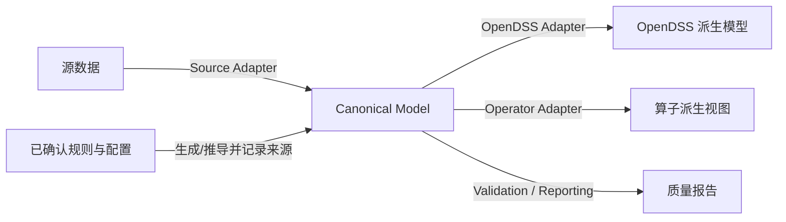

# 统一电网数据模型规范

## 1. 文档信息

| 项目 | 值 |
|---|---|
| 状态 | Draft，待业务确认 |
| 规范版本 | `0.3.0` |
| 需求依据 | `docs/intent.md` |
| 适用范围 | 与数据源、存储格式和下游消费者无关的稳定领域契约 |

本文定义统一电网数据模型（Canonical Grid Model，以下简称 Canonical Model）的字段语义、质量表达、来源追踪和依赖边界。本文不规定物理存储、编程语言、数据库、生成算法或任何消费者的文件/张量格式。

本文中的“必须”“不得”是强约束，“应”是推荐约束，“可”表示可选能力。

## 2. 职责与边界

### 2.1 Canonical Model 的职责

Canonical Model 必须：

1. 以字符串安全的方式保留源标识符、源记录定位和原始引用；
2. 统一描述当前需要的站点、馈线、母线、设备、端点、电气属性和运行数据；
3. 明确字段含义、单位、可空性、质量状态和来源；
4. 允许“不完整但忠实”的导入结果，不通过虚构值换取表面完整；
5. 区分源引用解析和已确认的电气连接关系；
6. 为 Source Adapter、OpenDSS Adapter 和未来 Operator Adapter 提供稳定的输入契约。

Canonical Model 描述“数据中有什么、含义是什么、质量如何、从何而来”。它不判断某个特定消费者能否使用这些数据。

### 2.2 非目标

本文不：

- 恢复真实电网参数或真实历史运行状态；
- 为缺失字段指定虚构默认值；
- 将名称相近、数值接近或恰好匹配的源引用自动认定为物理电气连接；
- 把源数据中的混合实体图静默转换成母线—支路拓扑；
- 定义一个全局、绝对的 `simulation_readiness` 或消费者就绪等级；
- 规定 Snapshot、QSTS 或 OpenDSS 的完整输入条件；
- 假设未来智能电网算子的字段、张量形状、文件格式、采样窗口或质量阈值；
- 规定参数补全、拓扑修复、数据生成或适配器实现。

### 2.3 当前要求与未来扩展

当前合同只覆盖南京数据能够提供的实体，以及近期 OpenDSS/QSTS 工作流需要承载的中立数据概念。`Load`、`DER` 和时序数据虽在当前源数据中为空，因已属于 `docs/intent.md` 的近期范围而保留。

以下仅作为扩展边界，不是已承诺的当前合同：

- 新设备类型可在获得实际数据和字段语义后增加；
- 新算子通过 Adapter 扩展，不预先改变 Canonical Model；
- 只有多个已知需求表现出稳定共性时，才考虑把消费者字段提升为 Canonical 字段。

## 3. 分层与依赖方向

- Canonical Model 不依赖源 CSV 列名、OpenDSS 对象名或算子格式。
- 所有 Adapter 依赖 Canonical Model；Canonical Model 不反向依赖 Adapter。
- 消费者需要的拓扑投影、必填字段、默认策略和就绪检查由对应 Adapter 规范定义。
- Adapter 输出是派生物，不得回写并冒充源事实或未经说明的 Canonical 事实。

## 4. 通用类型与约束

### 4.1 基础类型

| 类型 | 定义 |
|---|---|
| `Identifier` | 非空 Unicode 字符串；大小写、前导零和后缀字符有意义 |
| `CanonicalId` | Canonical 内部稳定 ID；唯一作用域由实体定义 |
| `SourceId` | 源字段原文，去除 CSV 结构性引号后不得改写 |
| `Decimal` | 十进制定点数；标识符或精确十进制文本不得先经过二进制浮点数 |
| `Boolean` | `true` / `false`；源值归一化规则属于 Source Adapter 映射规范 |
| `PhaseSet` | 相位有序集合；未知为 `null`，不得默认 `ABC` |
| `Timestamp` | ISO 8601 时间戳；用于 `ABSOLUTE` 时间基准时必须携带偏移量或引用明确时区 |
| `DurationSeconds` | 非负十进制秒数；允许表达非整数秒间隔 |
| `EntityRef` | `{entity_type, entity_id}`，指向 Canonical 实体 |
| `SourceReference` | `{raw_ref, resolved_source_ref, resolution_status}`；保留源引用及其解析结果，不表达物理连接 |
| `Quantity` | 十进制值加显式单位；同一字段不得混用单位 |

### 4.2 标识符和作用域

- 所有源 ID 和引用必须按字符串读取和保存，禁止经由浮点数转换。
- `case_id` 表示一次可独立导入和处理的算例，其派生依据由数据源映射规范定义。
- 源 ID 可以跨算例或跨实体类型重复。源实体的逻辑键至少包含 `case_id + entity_type + source_id`。
- 同一逻辑键对应多条源记录时，不得覆盖或静默去重。导入层必须用 `source_record_ref` 区分记录。
- 内容完全相同和内容冲突的重复记录必须分别标记；冲突在治理确认前不得合并。
- 由单条源记录直接建立、并以 `source_id` 表达源身份的顶层实体必须具有 `identity_status`。当前范围仅为 Station、Feeder、Bus 和 Equipment。
- Terminal、TransformerWinding 以及 Line、SwitchingDevice、Transformer、AccessPoint、Load、DER 等复用 Equipment 身份的子记录不单独定义 `identity_status`；其可追踪性由所属顶层实体和 `source_record_ref` 提供。
- Adapter 可生成目标系统安全名称，但不得替换 Canonical ID 或源 ID。

### 4.3 空值和未知状态

- 源空字符串映射为 `null`；不得把缺失值替换为零、空对象、默认相位或虚构时间。
- 数值 `0` 不等同于空值。引用字段中的字符串 `"0"` 仍是原始值，可另标记为无效候选。
- `UNKNOWN`、`NOT_AVAILABLE`、`NOT_APPLICABLE`、`MISSING` 和 `UNRESOLVED` 不得用同一个魔法值混合表达。需要区分时，使用相邻状态字段或质量事件。
- 未知枚举值必须保留源文本，并映射为 `UNKNOWN` 或开放扩展值，不得丢弃整条记录。

### 4.4 通用枚举

| 语义 | Canonical 值 |
|---|---|
| 开关状态 | `OPEN`、`CLOSED`、`UNKNOWN` |
| 记录/字段来源 | `SOURCE`、`RULE_GENERATED`、`DERIVED`、`REPAIRED`、`MANUAL` |
| 源引用解析 | `MISSING`、`EXACT`、`NORMALIZED_CANDIDATE`、`AMBIGUOUS`、`UNRESOLVED`、`CONFIRMED_REPAIR` |
| 电气连接确认 | `NOT_ASSESSED`、`MISSING`、`CONFIRMED`、`AMBIGUOUS`、`UNRESOLVED` |
| 数据质量 | `VALID`、`SUSPECT`、`INVALID`、`TIME_UNKNOWN` |
| 质量事件严重度 | `INFO`、`WARNING`、`ERROR` |
| 身份状态 | `UNIQUE`、`DUPLICATE_IDENTICAL`、`DUPLICATE_CONFLICT` |
| Source Adapter 导入状态 | `COMPLETE`、`INCOMPLETE`、`FAILED` |
| 时间基准 | `ABSOLUTE`、`RELATIVE` |

## 5. 源引用与电气连接

### 5.1 三个必须分离的概念

| 概念 | 字段 | 含义 |
|---|---|---|
| 原始源引用 | `raw_connected_ref` | 源字段原文，只陈述源记录写了什么 |
| 已解析源引用 | `resolved_source_ref` | 原文在给定作用域中精确或经确认修复后指向哪个 Canonical 源实体 |
| 规范化电气连接 | `connectivity_node_ref` | 经权威资料或显式、版本化规则确认的电气连接节点 |

`raw_connected_ref` 或 `resolved_source_ref` 指向 `Switch`、`Transformer`、`Station`、`AccessPoint` 或 `Bus`，只说明源引用关系。即使原文精确匹配某个实体，也不自动证明物理电气连接。

非 Terminal 字段使用 `SourceReference` 组合类型：

| 字段 | 类型 | 必需性 | 说明 |
|---|---|---:|---|
| `raw_ref` | `SourceId` | N | 源引用原文；源字段为空时为 null |
| `resolved_source_ref` | `EntityRef` | N | 已解析的源实体 |
| `resolution_status` | enum | R | 源引用解析状态 |

### 5.2 源引用解析

源引用解析只回答“原文可能指向哪条源实体记录”，按以下状态处理：

1. 空引用为 `MISSING`，不补全；
2. 同一 `case_id` 和允许实体类型内唯一精确匹配为 `EXACT`；
3. 精确命中多条记录或冲突身份为 `AMBIGUOUS`；
4. 科学计数法展开、已知精度损失等只能先成为 `NORMALIZED_CANDIDATE`；
5. 只有显式、版本化且可审计的规则确认后才是 `CONFIRMED_REPAIR`；
6. 无可确认目标时为 `UNRESOLVED`。

禁止通过名称模糊匹配、最近数值 ID、目录名猜测或无记录重连自动确认引用。

### 5.3 电气连接确认

- `connectivity_node_ref` 与 `connectivity_status` 独立于源引用解析状态。
- `EXACT` 不蕴含 `connectivity_status=CONFIRMED`。
- 没有连接语义依据时，`connectivity_status` 必须为 `NOT_ASSESSED`，`connectivity_node_ref` 必须为 `null`。
- 母线合并、设备折叠、虚拟节点或母线—支路投影若为消费者所需，必须由对应 Adapter 产生独立派生视图和映射清单。
- 任何被确认的连接修复必须保留原引用并记录字段级 provenance。

因此，Canonical 层面的“解析”只评价引用是否能够无歧义地指向源实体，不包含连通、孤岛、辐射性或潮流可解性等消费者特定要求。

## 6. 核心数据模型

下表中：`R` 表示形成该 Canonical 记录时必需，`N` 表示允许为空，`C` 表示条件必需。这里的必需性只用于 Canonical 数据有效性，不代表 OpenDSS 或任何算子就绪。

### 6.1 通用可追踪记录

所有记录必须声明整体来源。由单条源记录直接建立的实体还必须携带记录定位和映射版本：

| 字段 | 类型 | 必需性 | 说明 |
|---|---|---:|---|
| `record_origin` | enum | R | 记录整体来源 |
| `source_record_ref` | string | C | 与单条源记录一一对应时必需；稳定定位到文件与记录序号 |
| `source_mapping_id` | string | C | `SOURCE` 记录或字段直接映射时必需 |
| `source_mapping_version` | string | C | 与映射规范版本一起解释直接字段映射 |

聚合多条源记录形成的实体必须通过字段级 provenance 定位各源记录，不伪造单一 `source_record_ref`。生成且没有对应源记录的实体也不伪造 `source_record_ref`，但必须通过字段或记录级 provenance 指向生成规则、配置和随机种子（如使用随机过程）。

### 6.2 Dataset 与 GridCase

#### Dataset

| 字段 | 类型 | 必需性 | 说明 |
|---|---|---:|---|
| `dataset_id` | `CanonicalId` | R | 一次源数据批次 |
| `name` | string | R | 数据集名称 |
| `source_uri` | string | N | 源位置或受控引用 |
| `source_checksum` | string | N | 源制品校验值 |
| `canonical_spec_version` | string | R | 本规范版本 |
| `imported_at` | `Timestamp` | R | 导入行为发生时间，不是业务运行时间 |
| `import_status` | enum | R | Source Adapter 合同相对的导入状态 |

#### GridCase

| 字段 | 类型 | 必需性 | 说明 |
|---|---|---:|---|
| `case_id` | `CanonicalId` | R | 算例内部 ID |
| `dataset_id` | `CanonicalId` | R | 所属数据集 |
| `source_case_key` | string | C | 源数据存在算例分区时精确保留 |
| `feeder_ref` | `EntityRef` | N | 已建立的馈线实体引用 |

Canonical `GridCase` 不包含全局 `simulation_readiness`。源引用解析状态可由报告按 case 汇总，不作为消费者就绪字段。

### 6.3 Station、Feeder 与 Bus

| 实体 | 字段 | 类型 | 必需性 | 单位/说明 |
|---|---|---|---:|---|
| Station | `station_id` | `CanonicalId` | R | 算例内唯一 |
| Station | `case_id` | `CanonicalId` | R | 所属算例 |
| Station | `source_id` | `SourceId` | C | 源实体存在时必需 |
| Station | `identity_status` | enum | R | 源身份唯一、重复相同或重复冲突 |
| Station | `station_type` | string/enum | N | 保留未知源值 |
| Station | `name` | string | N | 站点名称 |
| Station | `nominal_voltage_kv` | `Decimal` | N | kV |
| Station | `longitude` | `Decimal` | N | CRS 确认前不得解释 |
| Station | `latitude` | `Decimal` | N | CRS 确认前不得解释 |
| Station | `coordinate_crs` | string | C | 坐标存在时必需 |
| Feeder | `feeder_id` | `CanonicalId` | R | 算例内唯一 |
| Feeder | `case_id` | `CanonicalId` | R | 所属算例 |
| Feeder | `source_id` | `SourceId` | C | 源实体存在时必需 |
| Feeder | `identity_status` | enum | R | 源身份唯一、重复相同或重复冲突 |
| Feeder | `name` | string | N | 不作为主键 |
| Feeder | `source_bus_source_ref` | `SourceReference` | N | 不自动声明电气连接 |
| Bus | `bus_id` | `CanonicalId` | R | 算例内唯一 |
| Bus | `case_id` | `CanonicalId` | R | 所属算例 |
| Bus | `source_id` | `SourceId` | C | 允许前导零和后缀 |
| Bus | `identity_status` | enum | R | 源身份唯一、重复相同或重复冲突 |
| Bus | `name` | string | N | 母线名称 |
| Bus | `base_voltage_kv` | `Decimal` | N | kV |
| Bus | `phases` | `PhaseSet` | N | 未知不得默认 |
| Bus | `station_source_ref` | `SourceReference` | N | Station 源引用及解析状态 |
| Bus | `is_source` | `Boolean` | N | 源数据声明，不代表 Adapter 已选定源 |

### 6.4 Equipment 与 Terminal

#### Equipment

| 字段 | 类型 | 必需性 | 说明 |
|---|---|---:|---|
| `equipment_id` | `CanonicalId` | R | 算例内所有 Equipment 中唯一 |
| `case_id` | `CanonicalId` | R | 所属算例 |
| `source_id` | `SourceId` | C | 源实体存在时必需 |
| `equipment_type` | enum | R | 当前为 `LINE`、`SWITCH`、`DISCONNECTOR`、`EARTHING_SWITCH`、`TRANSFORMER`、`ACCESS_POINT`、`LOAD`、`DER` |
| `name` | string | N | 未提供时保持 null |
| `phases` | `PhaseSet` | N | 未知不得默认 |
| `in_service` | `Boolean` | N | 不得由 `normal_state` 隐式推断 |
| `identity_status` | enum | R | 重复与冲突状态 |

#### Terminal

`Terminal` 表示设备可连接位置以及源端点陈述；仅在 `connectivity_status=CONFIRMED` 时表达已确认的规范化电气连接。

| 字段 | 类型 | 必需性 | 说明 |
|---|---|---:|---|
| `terminal_id` | `CanonicalId` | R | 端点内部 ID |
| `case_id` | `CanonicalId` | R | 所属算例 |
| `equipment_id` | `CanonicalId` | R | 所属设备 |
| `terminal_no` | integer | R | 从 1 开始，在设备内唯一 |
| `raw_connected_ref` | `SourceId` | N | 原始端点字段，不得改写 |
| `resolved_source_ref` | `EntityRef` | N | 已解析源实体；不代表物理连接 |
| `source_ref_status` | enum | R | 源引用解析状态 |
| `connectivity_node_ref` | `EntityRef` | N | 已确认规范化连接节点，当前目标类型为 `BUS` |
| `connectivity_status` | enum | R | 电气连接确认状态 |
| `phases` | `PhaseSet` | N | 比设备相位更具体时填写 |

设备应按其已知结构建立端点位置；源端点为空时可保留 Terminal，但 `source_ref_status=MISSING`。端点数量的消费者要求不在本文定义。

### 6.5 当前设备属性

以下字段用于承载当前南京数据和近期算例工作流已知的中立电气语义。字段为空仍可形成有效 Canonical 记录。

#### Line

| 字段 | 类型 | 必需性 | 单位/说明 |
|---|---|---:|---|
| `equipment_id` | `CanonicalId` | R | 对应 Equipment |
| `line_type` | string/enum | N | 未知不得推断 |
| `model` | string | N | 型号或模型名 |
| `length_km` | `Decimal` | N | km；非空时必须大于 0 |
| `r1_ohm_per_km` | `Decimal` | N | Ω/km |
| `x1_ohm_per_km` | `Decimal` | N | Ω/km |
| `r0_ohm_per_km` | `Decimal` | N | Ω/km |
| `x0_ohm_per_km` | `Decimal` | N | Ω/km |
| `c1_nf_per_km` | `Decimal` | N | nF/km |
| `c0_nf_per_km` | `Decimal` | N | nF/km |
| `rated_current_a` | `Decimal` | N | A |
| `number_of_circuits` | integer | N | 非空时为正整数 |
| `parameter_set_ref` | `EntityRef` | N | 中立参数集引用；不等同于 OpenDSS LineCode |

#### SwitchingDevice

| 字段 | 类型 | 必需性 | 单位/说明 |
|---|---|---:|---|
| `equipment_id` | `CanonicalId` | R | 对应 Equipment |
| `switch_kind` | enum | R | `SWITCH`、`DISCONNECTOR`、`EARTHING_SWITCH` |
| `normal_state` | enum | N | 规划常态 |
| `observed_state` | enum | N | 观测/当前状态 |
| `is_tie` | `Boolean` | N | 是否联络设备 |
| `rated_current_a` | `Decimal` | N | A |
| `measurement_capable` | `Boolean` | N | 是否声明具备量测能力 |

`normal_state`、`observed_state` 和 `in_service` 是不同概念，不得互相隐式赋值。

#### Transformer 与 TransformerWinding

| 实体 | 字段 | 类型 | 必需性 | 单位/说明 |
|---|---|---|---:|---|
| Transformer | `equipment_id` | `CanonicalId` | R | 对应 Equipment |
| Transformer | `rated_capacity_kva` | `Decimal` | N | kVA；非空时大于 0 |
| Transformer | `r_pct` | `Decimal` | N | 百分数 |
| Transformer | `x_pct` | `Decimal` | N | 百分数 |
| Transformer | `number_of_taps` | integer | N | 非空时为正整数 |
| Transformer | `tap_min_pu` | `Decimal` | N | 标幺值 |
| Transformer | `tap_max_pu` | `Decimal` | N | 标幺值 |
| Transformer | `tap_range_raw` | string | N | 语义未确认时保存原文 |
| TransformerWinding | `winding_id` | `CanonicalId` | R | 绕组 ID |
| TransformerWinding | `equipment_id` | `CanonicalId` | R | 所属变压器 |
| TransformerWinding | `winding_no` | integer | R | 从 1 开始，设备内唯一 |
| TransformerWinding | `terminal_id` | `CanonicalId` | R | 对应 Terminal |
| TransformerWinding | `rated_voltage_kv` | `Decimal` | N | kV |
| TransformerWinding | `connection` | string/enum | N | 接线方式 |
| TransformerWinding | `rated_capacity_kva` | `Decimal` | N | 从设备容量继承属于 `DERIVED` |

绕组子记录用于表达当前两绕组字段，也允许在有实际数据时表达多绕组设备；本文不要求为南京数据推断额外绕组。

#### AccessPoint、Load 与 DER

| 实体 | 字段 | 类型 | 必需性 | 单位/说明 |
|---|---|---|---:|---|
| AccessPoint | `equipment_id` | `CanonicalId` | R | 对应 Equipment |
| AccessPoint | `user_type` | string/enum | N | 用户类型 |
| AccessPoint | `contract_capacity_kva` | `Decimal` | N | kVA，非负 |
| Load | `equipment_id` | `CanonicalId` | R | 对应 Equipment |
| Load | `active_power_kw` | `Decimal` | N | kW |
| Load | `reactive_power_kvar` | `Decimal` | N | kvar |
| Load | `power_factor` | `Decimal` | N | 绝对值不大于 1 |
| Load | `power_factor_mode` | enum | N | `LEADING`、`LAGGING`、`UNKNOWN` |
| Load | `connection` | string/enum | N | 接线方式 |
| Load | `load_model` | string/enum | N | 不得默认 |
| Load | `nominal_voltage_kv` | `Decimal` | N | kV |
| DER | `equipment_id` | `CanonicalId` | R | 对应 Equipment |
| DER | `der_type` | string/enum | N | 类型未知时允许 null |
| DER | `rated_capacity_kva` | `Decimal` | N | kVA |
| DER | `rated_power_kw` | `Decimal` | N | kW |
| DER | `power_factor` | `Decimal` | N | 绝对值不大于 1 |
| DER | `connection` | string/enum | N | 接线方式 |
| DER | `control_mode` | string/enum | N | 中立语义，不使用 OpenDSS 专属枚举 |
| DER | `nominal_voltage_kv` | `Decimal` | N | kV |

AccessPoint 只是潜在接入位置，不自动等同于 Load、DER 或已确认连接节点。P、Q、PF 同时存在且不一致时保留原值并报告，不得静默覆盖。

### 6.6 运行场景与时间语义

#### OperatingScenario

| 字段 | 类型 | 必需性 | 说明 |
|---|---|---:|---|
| `scenario_id` | `CanonicalId` | R | 场景 ID |
| `case_id` | `CanonicalId` | R | 所属算例 |
| `name` | string | R | 场景名称 |
| `time_base` | enum | R | `ABSOLUTE` 或 `RELATIVE` |
| `absolute_start_time` | `Timestamp` | C | `ABSOLUTE` 时序场景必需 |
| `absolute_end_time` | `Timestamp` | C | `ABSOLUTE` 且声明闭合窗口时必需 |
| `timezone` | string | C | 时间戳未自带偏移量时必需；`RELATIVE` 不要求 |
| `relative_start_offset_seconds` | `DurationSeconds` | N | 相对场景起点偏移；省略时以 0 为相对原点 |
| `duration_seconds` | `DurationSeconds` | N | 场景时长 |
| `default_interval_seconds` | `DurationSeconds` | N | 固定间隔场景的默认步长 |
| `generation_config_ref` | string | N | 生成配置版本/校验值 |
| `random_seed` | integer/string | C | 使用随机过程时必需 |

#### OperationalSeries

| 字段 | 类型 | 必需性 | 说明 |
|---|---|---:|---|
| `series_id` | `CanonicalId` | R | 序列 ID |
| `scenario_id` | `CanonicalId` | N | 时间未知的源快照可为空 |
| `target_ref` | `EntityRef` | R | Bus、Equipment、Feeder 等目标 |
| `metric` | string/registry key | R | 如有功、无功、电流、电压、开关状态 |
| `unit` | string | C | 数值物理量必需 |
| `phase` | string | N | 分相序列时填写 |
| `series_kind` | enum | R | `SNAPSHOT` 或 `TIME_SERIES` |
| `value_type` | enum | R | `DECIMAL`、`BOOLEAN`、`CATEGORY` |
| `interval_seconds` | `DurationSeconds` | N | 可覆盖场景默认步长 |
| `quality` | enum | R | 序列整体质量 |

#### OperationalValue

| 字段 | 类型 | 必需性 | 说明 |
|---|---|---:|---|
| `series_id` | `CanonicalId` | R | 所属序列 |
| `timestamp` | `Timestamp` | C | `ABSOLUTE` 时间序列的每个点必需 |
| `offset_seconds` | `DurationSeconds` | C | `RELATIVE` 点可直接使用 |
| `sequence_no` | integer | C | `RELATIVE` 固定间隔序列可与 interval 共同定位；快照也可用于保序 |
| `decimal_value` | `Decimal` | C | 与其他 value 字段三选一 |
| `boolean_value` | `Boolean` | C | 与其他 value 字段三选一 |
| `category_value` | string | C | 与其他 value 字段三选一 |
| `quality` | enum | R | 点级质量 |

时间约束：

- `ABSOLUTE` 时间序列使用真实、已知的时间戳；点必须按时间唯一且严格递增。
- `RELATIVE` 时间序列不要求 ISO 时间戳。点可使用 `offset_seconds`，或使用从 0 开始的 `sequence_no + interval_seconds` 推导偏移。
- 同一序列必须能以一种明确方式排序；不得混用互相矛盾的绝对时间和相对偏移。
- 合成 QSTS 数据应优先使用符合场景需求的相对时间，除非需求明确给出真实或约定的绝对起点。
- 绝不得仅为满足 schema 而编造历史日期、时区或“看似真实”的时间戳。
- 时间未知的源量测只能作为 `SNAPSHOT` 且标记 `TIME_UNKNOWN`，不能拼成伪时间序列。

### 6.7 SimulationProfile

`SimulationProfile` 仅承载源数据或配置声明的中立仿真意图及参数，不证明任何引擎可执行。

| 字段 | 类型 | 必需性 | 单位/说明 |
|---|---|---:|---|
| `simulation_profile_id` | `CanonicalId` | R | 配置 ID |
| `case_id` | `CanonicalId` | R | 所属算例 |
| `scenario_id` | `CanonicalId` | N | 关联运行场景 |
| `mode` | string/enum | N | 如 Snapshot、QSTS；保留未知值 |
| `solver` | string/enum | N | 求解方法声明 |
| `frequency_hz` | `Decimal` | N | Hz |
| `source_voltage_kv` | `Decimal` | N | kV |
| `source_bus_source_ref` | `SourceReference` | N | 源母线声明，不自动成为连接节点 |
| `output_voltage_bus_source_ref` | `SourceReference` | N | 观测母线声明 |
| `max_iterations` | integer | N | 正整数 |
| `tolerance` | `Decimal` | N | 精确语义由产生方或消费者规范说明 |
| `mva_sc3` | `Decimal` | N | 三相短路容量，MVA |
| `mva_sc1` | `Decimal` | N | 单相短路容量，MVA |
| `unit_system` | string/enum | N | 单位制声明 |
| `extensions` | namespaced map | N | 未提升为核心字段的源配置 |

### 6.8 质量事件与字段来源

#### DataQualityIssue

| 字段 | 类型 | 必需性 | 说明 |
|---|---|---:|---|
| `issue_id` | `CanonicalId` | R | 质量事件 ID |
| `case_id` | `CanonicalId` | N | 数据集级问题可为空 |
| `target_ref` | `EntityRef` | N | 相关实体 |
| `field_path` | string | N | 相关字段 |
| `code` | string | R | 稳定问题代码 |
| `severity` | enum | R | 严重度 |
| `observed_value` | string | N | 必要时保留原文 |
| `message` | string | R | 可读说明 |

#### FieldProvenance

生成、推导、修复和人工修改的字段必须显式可追踪：

| 字段 | 类型 | 必需性 | 说明 |
|---|---|---:|---|
| `provenance_id` | `CanonicalId` | R | 来源记录 ID |
| `case_id` | `CanonicalId` | N | 数据集级字段可为空 |
| `target_ref` | `EntityRef` | R | 目标实体 |
| `field_path` | string | R | 目标字段路径 |
| `origin` | enum | R | `SOURCE`、`RULE_GENERATED`、`DERIVED`、`REPAIRED`、`MANUAL` |
| `source_record_ref` | string | C | 依赖源记录时必需 |
| `source_field` | string | N | 相关源字段 |
| `rule_id` | string | C | 生成、推导或修复时必需 |
| `rule_version` | string | C | 与 `rule_id` 同时必需 |
| `config_ref` | string | C | 规则读取配置时必需 |
| `random_seed` | integer/string | C | 使用随机过程时必需 |
| `assumption` | string | N | 可读假设说明 |
| `changed_by` | string | C | 人工修改时必需 |

直接复制或简单类型归一化的 `SOURCE` 字段，不要求为每个字段物理生成一条 `FieldProvenance`。当实体的 `source_record_ref` 与版本化 `source_mapping_id/source_mapping_version` 足以唯一反查源列和转换规则时，即满足追踪要求。

下列情况仍必须建立字段级 provenance：规则生成、跨字段或跨记录推导、已确认修复、人工修改，以及无法仅凭映射版本唯一解释的非平凡源转换。

## 7. Canonical 有效性与质量

### 7.1 Import Complete

`Import Complete` 是相对于某一 Source Adapter 输入合同的导入结果，不是固定为南京 12 类 CSV，也不代表数据可仿真。

`Dataset.import_status` 的取值和判定如下：

| 状态 | 精确判定 |
|---|---|
| `COMPLETE` | Adapter 已走完导入流程；输入合同声明的每个文件位置都已被识别为存在、缺失、空或 schema 异常等明确状态；每条可定位源记录都已转换为 Canonical 记录，或作为未映射源记录完整保留并附有质量事件；每个非空源值均已映射、原文保留或以质量事件记录。 |
| `INCOMPLETE` | 已能建立 Dataset 身份并产生可识别的部分结果，但存在已知文件、源记录或非空值未被 account for，例如读取中断、无法继续的解码失败、资源中断或内部错误后只留下部分输出。部分输出必须显式标记为不完整。 |
| `FAILED` | 无法建立可信的 Dataset 身份或输入清单，或失败发生在任何可信 Canonical/报告结果产生之前。该次运行不得将中间文件声明为导入结果。 |

至少要求：

- Adapter 声明的输入文件和 schema 已完成识别或形成明确质量事件；
- 每条被读取的源记录都有稳定 `source_record_ref`；
- 所有源 ID、原始引用和非空源值均被保留，或对无法转换的值记录原文和质量事件；
- 未知枚举、重复身份和转换失败未被静默丢弃。

Import Complete 允许 Canonical 字段为空、源引用未解析、连接未确认或存在冲突。

`DataQualityIssue` 的存在及其 `severity` 不直接决定 `import_status`。只要每个输入都已按上述合同被 account for，即使存在 `ERROR` 质量事件，导入仍可为 `COMPLETE`。`Canonical Valid` 由 7.2 节独立判定；消费者 readiness 由具体 Adapter 另行判定。

### 7.2 Canonical Valid

Canonical 有效性只检查本规范内部合同，例如：

- 必需字段、类型、单位和唯一作用域满足定义；
- Canonical 内部 `EntityRef` 指向存在的实体，或按允许状态为空；
- null、未知枚举、重复和冲突状态被显式表达；
- 绝对/相对时间符合各自约束；
- 必须追踪的生成、推导、修复和人工修改字段具有完整 provenance。

物理参数是否足够、连接图是否适合潮流、时间窗口是否符合某次 QSTS、某算子是否接受 `SUSPECT` 数据，都不属于 Canonical Valid 的判断。

### 7.3 最低质量检查

以下检查适用于非空值或已出现的关系。检查失败必须保留源值并形成 `DataQualityIssue`，不得通过删除或静默改写让数据“通过”。

| 类别 | Canonical 质量检查 |
|---|---|
| 标识 | 字符串安全读取、作用域内身份状态明确、重复和冲突可追踪 |
| 引用 | 作用域、候选目标类型和解析状态明确；无静默修复 |
| 连接 | 源引用与电气连接状态分离；连接依据可追踪 |
| 电压 | 非空值为正；Station nominal 与 Bus base 的差异只报告，不自动统一 |
| 线路 | 非空长度为正；参数有明确单位；回路数为正整数 |
| 变压器 | 非空容量和绕组电压为正；绕组与 Terminal 引用一致 |
| 负荷/DER | P、Q、PF 含义和符号约定明确；额定值与运行值分离 |
| 时序 | 时间基准明确、点可唯一排序、固定步长和缺口显式 |
| 量测 | 时间未知和离群值不伪装成有效时序数据 |
| 来源 | 生成、推导、修复和人工修改字段的规则、配置、版本及必要随机种子可追踪 |

质量检查描述数据质量，不声明任何消费者就绪。某个消费者可在自己的规范中决定哪些质量状态可接受。

### 7.4 源引用解析质量

可以按记录或算例汇总 `MISSING`、`EXACT`、`AMBIGUOUS`、`UNRESOLVED` 等状态。该汇总只报告源引用解析程度，不得命名为通用的 `Topology Resolved`，也不得隐含已经形成母线—支路图、网络连通、无孤岛、满足辐射性或可供某消费者使用。

### 7.5 四层数据状态与消费者就绪性

数据处理结果必须区分以下四个独立结论：

| 状态 | 判定边界 |
|---|---|
| Import Complete | Source Adapter 是否完整处理并 account for 输入；按 7.1 节判定 |
| Canonical Valid | Canonical 内部结构和约束是否满足；按 7.2 节判定 |
| OpenDSS Ready | 指定版本 OpenDSS Adapter 针对指定场景所需的拓扑、参数和模型是否具备 |
| Operator Ready | 指定算子及其版本的输入合同是否满足 |

这些状态不得合并为单一等级，也不得互相自动推导。本规范不定义全局 `Simulation Ready`。OpenDSS Ready 和 Operator Ready 必须是带消费者、版本及适用场景限定的判断，例如“某 OpenDSS Adapter 版本对某 Snapshot 场景是否就绪”。

Snapshot、QSTS、OpenDSS 对相位、线路参数、绕组参数、源等值、连接投影和时间序列的要求，应写入后续独立的 OpenDSS Adapter/readiness 规范。该规范在要求确认前不由本文代拟。

## 8. Adapter 扩展机制

### 8.1 Source Adapter

每个 Source Adapter 的映射规范必须声明源 schema、记录定位、字段映射、单位转换、枚举归一化、引用候选类型和 Import Complete 条件。源数据特有的统计与异常不进入本规范。

### 8.2 OpenDSS Adapter

OpenDSS Adapter 是 Canonical Model 的消费者。它负责目标格式命名、连接图投影、单位和对象转换、消费者就绪检查，以及 Canonical ID 与导出对象的映射。

OpenDSS 专属默认值和连接修复不得写回 Canonical 源事实。具体 Snapshot/QSTS 契约和就绪规则须在获得确认后另立规范。

### 8.3 Operator Adapter

Operator Adapter 目前只是扩展点。Canonical Model 不为尚未提供需求的未来算子发明字段、能力清单、张量结构或输出契约。

只有在某个具体算子的输入要求可用并经确认后，才为该算子新增独立 Adapter 合同。该合同可以选择 Canonical 数据并生成只读派生视图，但不得反向要求核心模型采用算子专属命名、排序或维度。

## 9. 版本与兼容性

- 规范使用语义化版本。
- 新增可选字段或枚举值通常是向后兼容的次版本变更。
- 删除字段、修改单位、改变字段语义或唯一键是主版本变更。
- Canonical 数据必须携带 `canonical_spec_version`。
- Source Adapter 映射版本与 Canonical 规范版本分别管理；映射变化不得只修改说明文本。
- 消费者 Adapter 必须显式声明支持的 Canonical 主版本。

## 10. 相关规范

| 文档 | 单一职责 |
|---|---|
| `docs/spec/canonical_data_spec.md` | 稳定领域合同、质量和 provenance 语义、依赖边界 |
| `docs/spec/source_import_foundation.md` | Source Import 实现基线、确定性 ID、错误分类和质量代码 |
| `docs/spec/nanjing_source_audit.md` | 南京源数据统计、分布、异常和数据事实 |
| `docs/spec/nanjing_mapping_spec.md` | 南京 12 类 CSV 到 Canonical Model 的 Source Adapter 映射 |
| `docs/decisions/open_questions.md` | 需甲方或领域专家确认的问题、当前证据和安全行为 |

当前不创建 generation rules 或 operator-specific 规范。OpenDSS Adapter/readiness 规范也应等目标版本、连接投影和场景输入要求确认后再创建。

## 11. 待确认的领域问题

1. 什么权威依据或治理流程可以把 `resolved_source_ref` 提升为 `connectivity_node_ref`？
2. 规范化连接节点是否始终复用 `Bus`，还是当前源模型需要独立的 ConnectivityNode 概念？在出现实际反例前不新增后者。
3. 哪些仿真配置具有跨引擎稳定语义，哪些应只保留在带命名空间的扩展或 OpenDSS Adapter 配置中？
4. 绝对时间场景的时区和起点由谁提供；哪些合成场景应明确采用相对时间？
5. OpenDSS Snapshot/QSTS 的目标版本、允许的派生/修复数据等级和分场景就绪条件是什么？
6. 首个具体算子的输入合同尚未提供；在提供前不扩展 Canonical 核心。
